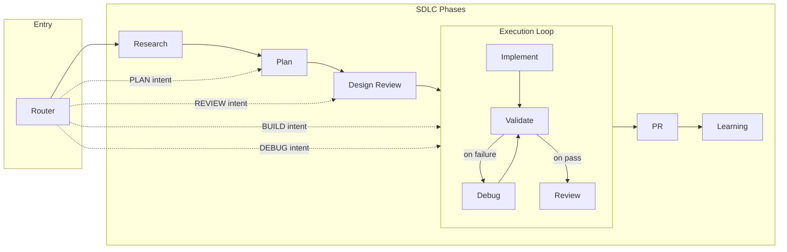

# Autonomis

SDLC orchestration for Claude Code and Cursor. One router detects your intent and runs the full pipeline or the right phase—with OWASP and performance as gates, state under `.autonomis/`, and hooks so state survives compaction.

---

## Install & setup

### Install the plugin

**Claude Code:**

```bash
/plugin marketplace add yariv1025/Autonomis
/plugin install autonomis@yariv1025-autonomis
```

**Cursor:** Clone the repo and add `plugins/autonomis` as a local plugin (it contains `.cursor-plugin/plugin.json`). See Cursor docs for "Add plugin from folder" or "Local plugin."

### Set up the router

Say: **"Set up Autonomis for me"**. The assistant will add the router to your instructions and pre-approve `.autonomis/` so the plugin can persist state.

**If you are the assistant:** When the user says "set up Autonomis", "install Autonomis", or similar:

- **Claude Code:** Follow [CLAUDE.md](CLAUDE.md): update `~/.claude/CLAUDE.md` with the Autonomis router entry and merge the `.autonomis/` permissions into `~/.claude/settings.json` using [claude-settings-template.json](claude-settings-template.json).
- **Cursor:** Follow the "Set up Autonomis for me" flow in [AGENTS.md](AGENTS.md) and add the snippet to the user's project (AGENTS.md or `.cursor/rules/`).

Then confirm: *"Autonomis is set up. Restart Claude Code / Cursor to activate."*

### Restart your IDE

Done.

---

## How it works

Autonomis routes your request by intent. You describe what you want (e.g. build a feature, fix a bug, review code); the router runs the full SDLC or the right phase. The Execution Loop is deterministic: Implement → Validate → on failure, Debug → Validate again → on pass, Review. Design Review and Code Review use an OWASP Top 10 and performance rubric—no sign-off without evidence.

High-level flow:

Open [autonomis-architecture-explorer.html](autonomis-architecture-explorer.html) in a browser for an interactive diagram.




---

## Quick start

- **"build a login flow"** — Router detects BUILD; Execution Loop (Implementer with TDD → Validator → on fail Debug Investigator → Code Reviewer); OWASP and performance rubric before sign-off; memory updated in `.autonomis/`.
- **"debug the failing test"** — DEBUG intent; Execution Loop with log-first investigation, fix, validate, review; outcome added to memory.
- **"review this branch"** — REVIEW intent; Design Review or Code Review with OWASP Top 10 and performance rubric; no sign-off without evidence.
- **"plan a settings page"** — PLAN intent; Planner (decomposition, DoD, security/performance in scope); Design Review gate before build.

---

## Workflow reference


| Intent     | Trigger words                              | Outcome                                                                  |
| ---------- | ------------------------------------------ | ------------------------------------------------------------------------ |
| **START**  | start, full pipeline, run the whole thing  | Research → Plan → Design Review → Execution Loop → PR → Learning         |
| **PLAN**   | plan, design, architect, roadmap, strategy | Plan phase; Design Review gate before build                              |
| **BUILD**  | build, implement, create, make, add        | Execution Loop: Implement → Validate → Debug → Review (TDD, OWASP gates) |
| **DEBUG**  | debug, fix, error, bug, broken             | Execution Loop with log-first investigation                              |
| **REVIEW** | review, audit, check, assess               | Design Review or Code Review (OWASP + performance)                       |


---

## Reference: agents and skills

### Agents


| Agent                  | Purpose                       | Key behavior                                                     |
| ---------------------- | ----------------------------- | ---------------------------------------------------------------- |
| **Researcher**         | Gather context and references | Outputs to `.autonomis/research/`; feeds Plan and Design Review  |
| **Planner**            | Decompose work, define DoD    | Security/performance in scope                                    |
| **Design Reviewer**    | Gate before build             | OWASP Top 10 + performance rubric; no pass without evidence      |
| **Implementer**        | Write code                    | TDD; follows plan and patterns                                   |
| **Validator**          | Run tests, checks             | Exit code 0 or it didn't happen; blocks until pass or escalation |
| **Debug Investigator** | Find root cause               | Log-first; fix; validate                                         |
| **Code Reviewer**      | Review implementation         | OWASP + performance; no sign-off without rubric                  |
| **PR Shepherd**        | PR phase                      | Handoff to human or automation                                   |
| **Learning**           | Update memory                 | Writes to `.autonomis/memory/`                                   |


### Skills

Skills are loaded by agents. You only invoke the router as the entry point.


| Skill                              | Used by                         | Purpose                                                |
| ---------------------------------- | ------------------------------- | ------------------------------------------------------ |
| **router**                         | Entry point                     | Detects intent; routes to full SDLC or single phase    |
| **session-memory**                 | Stateful agents                 | Persist context; load/save `.autonomis/`               |
| **verification-before-completion** | All agents                      | Evidence before claims; no sign-off without validation |
| **validator**                      | Execution Loop                  | Run tests and checks; pass/fail with evidence          |
| **test-driven-development**        | Implementer, Debug Investigator | RED–GREEN–REFACTOR                                     |
| **code-review-patterns**           | Code Reviewer, Design Reviewer  | Security, quality, performance rubrics                 |
| **planning-patterns**              | Planner                         | Decomposition, DoD, scope                              |
| **debugging-patterns**             | Debug Investigator              | Log-first; root cause analysis                         |
| **architecture-patterns**          | Multiple agents                 | System and API design                                  |
| **research**                       | Researcher, Planner             | Synthesis and interpretation of research               |
| **knowledge-extraction**           | Learning                        | Extract patterns and gotchas into memory               |


---

## State and hooks

### State (`.autonomis/`)

State lives under `.autonomis/` so it survives context compaction and restarts.

```
.autonomis/
├── state/       # Current phase, work units, router state
├── runs/        # Per-run snapshots (pre-compact recovery; see docs/known-flaws.md)
├── memory/      # Patterns, common gotchas, learnings
└── research/    # Research outputs
```

Every workflow loads state at start and updates at end. The pre-compact hook writes state to `.autonomis/runs/<runId>/` before compaction so recovery is possible when sub-agent output is lost ([FLAW-001](docs/known-flaws.md)).

### Hooks


| Hook                  | When                | Purpose                                                |
| --------------------- | ------------------- | ------------------------------------------------------ |
| **session-start**     | Session start       | Load `.autonomis/` state and inject into context       |
| **pre-compact**       | Before compaction   | Write state to `.autonomis/runs/<runId>/` for recovery |
| **pre-commit**        | Before git commit   | Optional: block unreviewed changes or run tests        |
| **plan-review-owasp** | After plan produced | Suggest OWASP skills based on plan keywords            |


Optional pre-commit install:  
`cp plugins/autonomis/hooks/pre-commit .git/hooks/pre-commit && chmod +x .git/hooks/pre-commit`

---

## Plugin structure

```
plugins/autonomis/
├── .claude-plugin/plugin.json
├── .cursor-plugin/plugin.json
├── agents/
│   ├── researcher.md
│   ├── planner.md
│   ├── design-reviewer.md
│   ├── implementer.md
│   ├── integration-verifier.md
│   ├── debug-investigator.md
│   ├── code-reviewer.md
│   ├── pr-shepherd.md
│   └── learning.md
├── skills/
│   ├── router/
│   ├── session-memory/
│   ├── verification-before-completion/
│   ├── validator/
│   ├── test-driven-development/
│   ├── code-review-patterns/
│   ├── planning-patterns/
│   ├── debugging-patterns/
│   ├── architecture-patterns/
│   ├── research/
│   └── knowledge-extraction/
└── hooks/
    ├── hooks.json
    ├── session-start.md
    ├── pre-compact.md
    ├── pre-commit
    └── plan-review-owasp.md
```

Repo root: [AGENTS.md](AGENTS.md) (Cursor), [CLAUDE.md](CLAUDE.md) (Claude Code), [CHANGELOG.md](CHANGELOG.md), [claude-settings-template.json](claude-settings-template.json), [autonomis-architecture-explorer.html](autonomis-architecture-explorer.html). Eval workspaces (`plugins/autonomis/skills/*-workspace/`) are gitignored and recreated locally when you run the eval pipeline.

---

## For contributors: evals and comparison

**Evaluating skills:** Skill definitions live under `plugins/autonomis/skills/<name>/` with `SKILL.md` and optional `evals/evals.json`. Eval tooling is in `.agents/skills/skill-creator/`. `*-workspace/` dirs are gitignored; create them when you run the pipeline. From `.agents/skills/skill-creator/`, use the scripts with `--skills-root` pointing at `plugins/autonomis/skills`. See script `--help` and the skill-creator skill for steps. Open generated `review.html` in the workspace to inspect outputs.

---

## Troubleshooting

**Claude Code keeps asking for permission to edit `.autonomis/`**  
Merge the permissions from [claude-settings-template.json](claude-settings-template.json) into `~/.claude/settings.json` under `permissions.allow`, or say **"Set up Autonomis for me"**.

**Router not activating**  

- Claude Code: Ensure `~/.claude/CLAUDE.md` contains the Autonomis section with the router entry (see [CLAUDE.md](CLAUDE.md)). Restart after editing.  
- Cursor: Ensure the project has [AGENTS.md](AGENTS.md) or a `.cursor/rules` rule with "invoke Autonomis router first". Restart if needed.

**State lost after compaction**  
The pre-compact hook writes state to `.autonomis/runs/<runId>/`. If output was still lost, see [docs/known-flaws.md](docs/known-flaws.md) (FLAW-001) for recovery.

---

## Inspired by

Autonomis builds on ideas from these open-source projects (MIT-licensed):


| Project                                            | What we drew from                                                                                                                                  |
| -------------------------------------------------- | -------------------------------------------------------------------------------------------------------------------------------------------------- |
| [cc10x](https://github.com/romiluz13/cc10x)        | Intent-based routing, router-as-single-entry-point, session memory, verification-before-completion, pre-compact state persistence, pre-commit gate |
| [babysitter](https://github.com/a5c-ai/babysitter) | Hook-driven orchestration, human escalation, iteration caps, quality gates                                                                         |
| [beads](https://github.com/steveyegge/beads)       | Task/dependency model; Autonomis uses a file-based store with an interface for an optional beads backend                                           |
| [metaswarm](https://github.com/dsifry/metaswarm)   | Selective context loading so memory stays bounded and relevant                                                                                     |


*If your project is listed and you want different attribution, please open an issue.*

---

**License:** MIT. See [LICENSE](LICENSE). **Version:** [CHANGELOG.md](CHANGELOG.md) (current: v0.1.0).