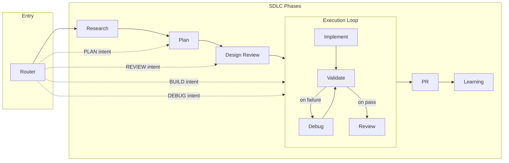

# Autonomis

**A dual-platform (Claude Code + Cursor) plugin for agentic development:** one SDLC-driven workflow—Research → Plan → Design Review → Execution Loop → PR → Learning—with security (OWASP Top 10) and performance built in from the start.

**Current version:** 0.1.0

---

## What Autonomis Does

- **Single entry point:** A router detects intent (START, PLAN, BUILD, DEBUG, REVIEW) and runs the right phase or full pipeline.
- **Deterministic execution loop:** Implement → Validate → (on fail) Debug → Validate → (on pass) Code Review. Fixed order; iteration cap and human escalation when validation keeps failing.
- **Security and performance first:** Design Review and Code Review must use OWASP Top 10 and a performance rubric; no sign-off without them.
- **File-based state:** Everything under `.autonomis/` (state, runs, memory, research). Optional beads-backed task store later.
- **Compaction-safe:** Pre-compact hook writes state to disk; session start loads it; recovery path when sub-agent output is lost (see [docs/known-flaws.md](docs/known-flaws.md)).

---

## How It Works

### High-Level Architecture

The Router is the only entry point. It detects your intent and either runs the full SDLC or jumps to a specific phase. The full pipeline is: **Research → Plan → Design Review → Execution Loop → PR → Learning**. The Execution Loop is deterministic (fixed order: Implement → Validate → on failure, Debug → Validate again → on pass, Review).



- **Router** detects intent: **START** (full SDLC), **PLAN**, **BUILD**, **DEBUG**, **REVIEW**. It routes to the matching phase; e.g. PLAN → Plan phase, BUILD/DEBUG → Execution Loop, REVIEW → Design Review or code review inside Execution.
- **Execution Loop** order is fixed: Implement → Validate → (on fail) Debug → Validate again → (on pass) Review. Only the content of each step is model-dependent; the pipeline itself is deterministic and testable.
- **Design Review** and **Code Review** (inside Execution) both enforce OWASP Top 10 and a performance rubric before sign-off.

### From your perspective

```
┌─────────────────────────────────────────────────────────────────────────────┐
│  YOU: "build a login flow" / "debug the failing test" / "review this PR"    │
│                              ┌──────────────────────────────────────────┐   │
│                       ┌──────►  Research → Plan → Design Review         │   │
│                       │      │  (OWASP + performance gates)             │   │
│                       │      └───────────────────┬──────────────────────┘   │
│  ┌─────────────────┐  │                          │                          │
│  │                 │  │      ┌───────────────────▼──────────────────────┐   │
│  │                 │──┼──────►  BUILD/DEBUG/REVIEW ──► Execution Loop   │   │
│  │     Router      │  │      │ (Implement → Validate → Debug → Review)  │   │
│  │                 │  │      └───────────────────┬──────────────────────┘   │
│  │                 │  │                          │                          │
│  └─────────────────┘  │      ┌───────────────────▼──────────────────────┐   │
│                       └──────►  PR → Learning                           │   │
│                              │  (memory updated for next session)       │   │
│                              └──────────────────────────────────────────┘   │
└─────────────────────────────────────────────────────────────────────────────┘
```

**You say what you want. The router runs the right phase and agents.**

---

## Install

The plugin is distributed via GitHub only. Install using Claude Code’s marketplace commands or by cloning and adding the plugin directory (Cursor).

### Claude Code

Add the repo as a marketplace, then install the plugin:

```bash
/plugin marketplace add yariv1025/Autonomis
/plugin install autonomis@yariv1025-autonomis
```

Then restart Claude Code.

### Cursor

1. **Clone the repo**:
   ```bash
   git clone https://github.com/yariv1025/Autonomis.git
   cd Autonomis
   ```
2. **Add as a local plugin** — In Cursor, add `plugins/autonomis` as a local plugin (it contains `.cursor-plugin/plugin.json`). See Cursor docs for “Add plugin from folder” or “Local plugin”.

### After install

- **Optional:** Run interactive install (when implemented) to set IDE, project type, and OWASP suggestions.
- **Optional:** Install the pre-commit hook:  
  `cp plugins/autonomis/hooks/pre-commit .git/hooks/pre-commit && chmod +x .git/hooks/pre-commit`

---

## Quick Start

### Use the router

Ask to build, plan, review, or debug. The router loads state from `.autonomis/` and runs the right phase.

| You say… | Router does |
|----------|-------------|
| "Plan a settings page" | PLAN → Planner (decomposition, DoD, security/performance in scope) |
| "Build the login flow" | BUILD → Execution Loop (Implement → Validate → Debug → Review) |
| "Debug the failing test" | DEBUG → Execution Loop (log-first, then fix, then validate) |
| "Review this branch" | REVIEW → Design Review or Code Review (OWASP + performance rubric) |

### Runtime state

The plugin creates and uses `.autonomis/` in your project root: state, runs, memory, research. See [.autonomis/README.md](.autonomis/README.md).

---

## Layout

```
plugins/autonomis/
├── .claude-plugin/plugin.json    # Claude Code manifest
├── .cursor-plugin/plugin.json    # Cursor Marketplace manifest
├── agents/                       # Planner, Implementer, Code Reviewer, etc.
├── skills/                       # router, session-memory, validator, TDD, etc.
├── hooks/                        # session-start, pre-compact, pre-commit, plan-review-owasp
│   ├── hooks.json                # Hook registration (Cursor)
│   ├── session-start.md
│   ├── pre-compact.md
│   ├── pre-commit                # Install to .git/hooks/pre-commit
│   └── plan-review-owasp.md
.autonomis/                       # Runtime state (created by plugin)
docs/                             # known-flaws.md only (user-facing behavior)
.agents/skills/skill-creator/     # Eval pipeline for contributors (see below)
```

Eval workspaces (`plugins/autonomis/skills/*-workspace/`) are **not** in the repo; they are recreated when you run the eval pipeline locally.

---

## Evaluating Skills (For Contributors)

You can run the full skill evaluation pipeline from this repo—for **personal use** (e.g. to check a skill) or to **contribute** improvements. The published plugin does not include eval workspaces or pipeline docs; you keep those locally.

### What’s in the repo

- **Skill definitions** — Each skill under `plugins/autonomis/skills/<name>/` has `SKILL.md` and optionally `evals/evals.json` (assertions).
- **Eval tooling** — `.agents/skills/skill-creator/` contains scripts to run evals, grade runs, aggregate benchmarks, and generate the review HTML. Use the scripts with `--help` for usage; pipeline steps and timing capture are described in the skill-creator skill or in the script logic.

### What’s not in the repo (stay local)

- **Eval workspaces** — `plugins/autonomis/skills/<name>-workspace/` (e.g. `router-workspace/`, `validator-workspace/`) are **gitignored**. They hold iteration dirs, run outputs, grading, timing, benchmarks, and `review.html`. You create them when you run the pipeline.
- **Pipeline and planning docs** — Detailed pipeline steps, rubrics, and comparison/feedback docs are not shipped; keep your own notes locally if you run evals.

### How to run evals

1. **Clone the repo** and ensure you have Python 3 and either the Anthropic API or the `claude` CLI.
2. **API key vs CLI:** An **API key** is needed for token counts and full metrics in the benchmark. **Without an API key**, you can use the **Claude CLI** (`claude`); the pipeline then records **duration-only** timing (no token counts). Use the scripts with `--use-cli` (or the default when no API key is set) for CLI-based runs.
3. **Add or use** `.agents/skills/skill-creator/` (from the [skill-creator](https://skills.sh/anthropics/skills/skill-creator) skill or your local copy).
4. **Run from the skill-creator directory**, e.g.:
   ```bash
   cd .agents/skills/skill-creator
   python3 -m scripts.run_all_content_evals --skills-root ../../plugins/autonomis/skills --timeout 90
   # Then grade, aggregate, and generate review per iteration (see script --help and skill-creator docs).
   ```
5. **Open the generated viewer** at e.g. `plugins/autonomis/skills/<skill>-workspace/iteration-1/review.html` to review outputs and benchmarks.

Re-running evals: run the same pipeline; your local `*-workspace/` dirs are updated and stay untracked.

---

## Inspired By

Autonomis synthesizes ideas from four open-source projects (all MIT-licensed), which we thank and recommend exploring:

| Project | What we drew from |
|--------|---------------------|
| **cc10x** ([github.com/romiluz13/cc10x](https://github.com/romiluz13/cc10x)) | Intent-based routing (BUILD/DEBUG/REVIEW/PLAN), router-as-single-entry-point, session memory and verification-before-completion disciplines, pre-compact state persistence and recovery (FLAW-001), pre-commit test gate. |
| **babysitter** ([github.com/a5c-ai/babysitter](https://github.com/a5c-ai/babysitter)) | Hook-driven orchestration, human escalation and iteration caps, quality gates and process structure. |
| **beads** ([github.com/steveyegge/beads](https://github.com/steveyegge/beads)) | Task and dependency model; Autonomis uses a file-based task store with an interface that allows an optional beads backend later. |
| **metaswarm** ([github.com/dsifry/metaswarm](https://github.com/dsifry/metaswarm)) | Selective context loading by scope (files, keywords, work type) so memory stays bounded and relevant. |

*If your project is listed here and you prefer different attribution or wording, please open an issue.*

---

## License

MIT. See [LICENSE](LICENSE).
