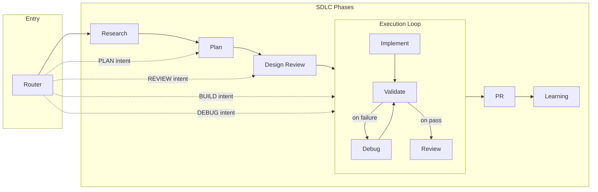

# Autonomis

### SDLC Orchestrator for Claude Code & Cursor

**Current version:** 0.1.0

**Recommended:** Create `~/.claude/CLAUDE.md` (Claude Code) or add project instructions via **AGENTS.md** (Cursor) so the router is active for development tasks.

<p align="center">
  <strong>1 Router</strong> &nbsp;•&nbsp; <strong>9 Agents</strong> &nbsp;•&nbsp; <strong>11 Skills</strong> &nbsp;•&nbsp; <strong>4 Hooks</strong>
</p>

<p align="center">
  <em>You say what you want. The router runs the right phase.</em>
</p>

---

## The Problem With Ad-Hoc Agent Use

Many agent setups leave you to guess:

```
❌ When to plan vs when to build
❌ Skipping design or security review to "move fast"
❌ No single entry point — you pick skills or agents manually
❌ Context lost on compaction; no recovery path
❌ No enforcement of OWASP or performance before sign-off
```

**Autonomis is different.** One router detects your intent and runs the full SDLC or the right phase. Security (OWASP Top 10) and performance are gates, not afterthoughts. State lives under `.autonomis/` and survives compaction.

---

## How It Works

```
┌─────────────────────────────────────────────────────────────────────────────┐
│  YOU: "build a login flow" / "debug the failing test" / "review this PR"   │
│                              ┌──────────────────────────────────────────┐   │
│                       ┌──────►  Research → Plan → Design Review         │   │
│                       │      │  (OWASP + performance gates)             │   │
│   ┌─────────────────┐  │      └───────────────────┬──────────────────────┘   │
│   │                 │  │                          │                          │
│   │     Router      │──┼──────►  BUILD/DEBUG ──► Execution Loop              │
│   │  (only entry    │  │        (Implement → Validate → Debug → Review)      │
│   │   point)        │  │                          │                          │
│   └─────────────────┘  │      ┌───────────────────▼──────────────────────┐   │
│                       └──────►  PR → Learning                             │   │
│                              │  (memory updated for next session)         │   │
│                              └───────────────────────────────────────────┘   │
└─────────────────────────────────────────────────────────────────────────────┘
```

**You say what you want. Autonomis figures out the rest.**

---

## 👤 FOR HUMANS: Read This

### Step 1: Install the plugin

**Claude Code:**

```bash
/plugin marketplace add yariv1025/Autonomis
/plugin install autonomis@yariv1025-autonomis
```

**Cursor:**

Clone the repo and add `plugins/autonomis` as a local plugin (it contains `.cursor-plugin/plugin.json`). See Cursor docs for "Add plugin from folder" or "Local plugin."

### Step 2: Set up the router

In Claude Code or Cursor, say: **"Set up Autonomis for me"**

The assistant will add the router to your global instructions and pre-approve `.autonomis/` so the plugin can persist state without prompting every time.

### Step 3: Restart your IDE

Done.

---

## 🤖 FOR CLAUDE CODE / CURSOR: Execute This

**When the user says "set up Autonomis", "install Autonomis", or similar:**

- **Claude Code:** Follow the steps in [CLAUDE.md](CLAUDE.md): update `~/.claude/CLAUDE.md` with the Autonomis router entry and merge the `.autonomis/` permissions into `~/.claude/settings.json`. Use [claude-settings-template.json](claude-settings-template.json) for the exact lines.
- **Cursor:** Cursor uses **AGENTS.md** (and/or `.cursor/rules/`), not CLAUDE.md. Follow the "Set up Autonomis for me" flow in [AGENTS.md](AGENTS.md) and add the provided snippet to the user's project.

Then confirm: *"Autonomis is set up. Restart Claude Code / Cursor to activate."*

---

## The 5 Intents

| Intent | Trigger words | What happens |
|--------|----------------|--------------|
| **START** | start, full pipeline, run the whole thing | Research → Plan → Design Review → Execution Loop → PR → Learning |
| **PLAN** | plan, design, architect, roadmap, strategy | Plan phase: decomposition, DoD, security/performance in scope |
| **BUILD** | build, implement, create, make, add | Execution Loop: Implement → Validate → Debug → Review (TDD, OWASP gates) |
| **DEBUG** | debug, fix, error, bug, broken | Execution Loop with log-first investigation, then fix and validate |
| **REVIEW** | review, audit, check, assess | Design Review or Code Review with OWASP Top 10 + performance rubric |

---

## What Makes Autonomis Different

<table>
<tr>
<td width="50%">

### Without Autonomis

```
❌ You choose plan vs build vs review
❌ Security and performance checked "later"
❌ No single entry point; skills used ad hoc
❌ State lost on compaction; no recovery
❌ No enforcement of verification before sign-off
```

</td>
<td width="50%">

### With Autonomis

```
✓ Router picks the right phase from your intent
✓ OWASP + performance gates before sign-off
✓ One entry point: router only
✓ .autonomis/ state; pre-compact hook persists
✓ Deterministic loop: Implement → Validate → Review
```

</td>
</tr>
</table>

---

## Quick Start Examples

### Build something

```
"build a login flow"

→ Router detects BUILD intent
→ Full SDLC or jump to Execution Loop
→ Implementer (TDD) → Validator → on fail: Debug Investigator → Code Reviewer
→ OWASP + performance rubric before sign-off
→ Memory updated in .autonomis/
```

### Fix a bug

```
"debug the failing test"

→ Router detects DEBUG intent
→ Execution Loop: log-first investigation, fix, validate, review
→ Added to memory for next session
```

### Review code

```
"review this branch"

→ Router detects REVIEW intent
→ Design Review or Code Review with OWASP Top 10 and performance rubric
→ No sign-off without evidence
```

### Plan first

```
"plan a settings page"

→ Router detects PLAN intent
→ Planner: decomposition, DoD, security/performance in scope
→ Design Review gate before build
```

---

## Architecture

```
USER REQUEST
     │
     ▼
┌─────────────────────────────────────────────────────────────────┐
│                 Autonomis Router (ONLY ENTRY POINT)              │
│              Detects intent → Full SDLC or single phase           │
└─────────────────────────────────────────────────────────────────┘
     │
     ├── START ──► Research → Plan → Design Review → Execution Loop → PR → Learning
     │
     ├── PLAN ───► Planner → (Design Review gate)
     │
     ├── BUILD ──► Execution Loop: Implement → Validate → Debug → Review
     │
     ├── DEBUG ──► Execution Loop (log-first)
     │
     └── REVIEW ─► Design Reviewer or Code Reviewer (OWASP + performance)

STATE (.autonomis/)
├── state/     ◄── Current phase, work units, router state
├── runs/      ◄── Per-run snapshots (pre-compact recovery)
├── memory/    ◄── Patterns, gotchas, learnings
└── research/  ◄── Research outputs
```

---

## High-Level Architecture (Diagram)

Full pipeline: **Research → Plan → Design Review → Execution Loop → PR → Learning**. The Execution Loop is deterministic: Implement → Validate → (on fail) Debug → Validate → (on pass) Review.

**Visual:** Open [autonomis-architecture-explorer.html](autonomis-architecture-explorer.html) in a browser for an interactive diagram.



---

## The 9 Agents

| Agent | Purpose | Key behavior |
|-------|---------|--------------|
| **Researcher** | Gather context and references | Feeds Plan and Design Review; outputs to `.autonomis/research/` |
| **Planner** | Decompose work, define DoD | Plan phase; security/performance in scope |
| **Design Reviewer** | Gate before build | OWASP Top 10 + performance rubric; no pass without evidence |
| **Implementer** | Write code | TDD; follows plan and patterns |
| **Validator** | Run tests, checks | Exit code 0 or it didn't happen; blocks until pass or escalation |
| **Debug Investigator** | Find root cause | Log-first; then fix; then validate |
| **Code Reviewer** | Review implementation | OWASP + performance; no sign-off without rubric |
| **PR Shepherd** | PR phase | Handoff to human or automation |
| **Learning** | Update memory | Writes patterns, gotchas, learnings to `.autonomis/memory/` |

---

## The 11 Skills

Skills are loaded by agents. You don't invoke them directly (except the router as entry point).

| Skill | Used by | Purpose |
|-------|---------|---------|
| **router** | Entry point | Detects intent; routes to full SDLC or single phase |
| **session-memory** | Stateful agents | Persist context across compaction; load/save `.autonomis/` |
| **verification-before-completion** | All agents | Evidence before claims; no sign-off without validation |
| **validator** | Execution Loop | Run tests and checks; pass/fail with evidence |
| **test-driven-development** | Implementer, Debug Investigator | RED–GREEN–REFACTOR |
| **code-review-patterns** | Code Reviewer, Design Reviewer | Security, quality, performance rubrics |
| **planning-patterns** | Planner | Decomposition, DoD, scope |
| **debugging-patterns** | Debug Investigator | Log-first; root cause analysis |
| **architecture-patterns** | Multiple agents | System and API design |
| **research** | Researcher, Planner | Synthesis and interpretation of research |
| **knowledge-extraction** | Learning | Extract patterns and gotchas into memory |

---

## Memory & State

Autonomis keeps everything under `.autonomis/` so state survives context compaction and session restarts.

```
.autonomis/
├── state/       # Current phase, work units, router state
├── runs/        # Per-run snapshots (pre-compact recovery; see docs/known-flaws.md)
├── memory/      # Patterns, common gotchas, learnings
└── research/    # Research outputs
```

**Iron rule:** Every workflow loads state at start and updates at end. The pre-compact hook writes state to disk before compaction so recovery is possible when sub-agent output is lost ([FLAW-001](docs/known-flaws.md)).

---

## Hooks

| Hook | When | Purpose |
|------|------|---------|
| **session-start** | Session start | Load `.autonomis/` state and inject into context |
| **pre-compact** | Before compaction | Write state to `.autonomis/runs/<runId>/` for recovery |
| **pre-commit** | Before git commit | Optional: block unreviewed changes or run tests |
| **plan-review-owasp** | After plan produced | Suggest OWASP skills based on plan keywords |

Install pre-commit (optional):  
`cp plugins/autonomis/hooks/pre-commit .git/hooks/pre-commit && chmod +x .git/hooks/pre-commit`

---

## Expected Behavior

### When you say "Build a login flow"

**Autonomis response:**

```
Detected BUILD intent. Running Execution Loop (or full SDLC if you prefer).

Loading state from .autonomis/...
Implementer: TDD cycle (RED → GREEN → REFACTOR).
Validator: running tests...
[If fail] Debug Investigator: log-first, then fix, then validate again.
Code Reviewer: OWASP Top 10 + performance rubric — no sign-off without evidence.
Learning: updating memory.
```

**Without Autonomis:**

```
I'll help you build a login flow! Let me start...
[Writes code without a gate]
[May skip tests or security review]
[No single entry point or state]
```

---

## Version History

| Version | Highlights |
|---------|------------|
| **v0.1.0** | Initial release: dual-platform (Claude Code + Cursor), 1 Router, 9 Agents, 11 Skills, 4 Hooks, `.autonomis/` state, OWASP + performance gates, compaction-safe hooks. |

Full history: [CHANGELOG.md](CHANGELOG.md).

---

## Files Structure

```
plugins/autonomis/
├── .claude-plugin/plugin.json
├── .cursor-plugin/plugin.json
├── agents/
│   ├── researcher.md
│   ├── planner.md
│   ├── design-reviewer.md
│   ├── implementer.md
│   ├── integration-verifier.md
│   ├── debug-investigator.md
│   ├── code-reviewer.md
│   ├── pr-shepherd.md
│   └── learning.md
├── skills/
│   ├── router/
│   ├── session-memory/
│   ├── verification-before-completion/
│   ├── validator/
│   ├── test-driven-development/
│   ├── code-review-patterns/
│   ├── planning-patterns/
│   ├── debugging-patterns/
│   ├── architecture-patterns/
│   ├── research/
│   └── knowledge-extraction/
└── hooks/
    ├── hooks.json
    ├── session-start.md
    ├── pre-compact.md
    ├── pre-commit
    └── plan-review-owasp.md
```

Repo root: [AGENTS.md](AGENTS.md) (Cursor), [CLAUDE.md](CLAUDE.md) (Claude Code), [CHANGELOG.md](CHANGELOG.md), [claude-settings-template.json](claude-settings-template.json), [autonomis-architecture-explorer.html](autonomis-architecture-explorer.html).

Eval workspaces (`plugins/autonomis/skills/*-workspace/`) are gitignored and recreated locally when you run the eval pipeline.

---

## Evaluating Skills (For Contributors)

You can run the skill evaluation pipeline from this repo for personal use or to contribute. The plugin does not ship eval workspaces or pipeline docs; you keep those locally.

- **In the repo:** Skill definitions under `plugins/autonomis/skills/<name>/` with `SKILL.md` and optional `evals/evals.json`. Eval tooling in `.agents/skills/skill-creator/`.
- **Not in the repo:** `*-workspace/` dirs (gitignored), detailed pipeline docs, rubrics. Create workspaces when you run the pipeline.

**Run evals:** From `.agents/skills/skill-creator/`, use the scripts with `--skills-root` pointing at `plugins/autonomis/skills`. See script `--help` and the skill-creator skill for steps. Open generated `review.html` in the workspace to inspect outputs and benchmarks.

### Testing the full plugin and comparing with other plugins (e.g. cc10x)

To **test Autonomis end-to-end** (router → agents → skills) in Claude Code or Cursor: install the plugin, run "Set up Autonomis for me", then try a few prompts (e.g. "build a small CLI…", "debug the failing test", "review this branch") and confirm the router runs, state goes to `.autonomis/`, and gates (OWASP, verification) appear as expected.

To **compare Autonomis vs cc10x (or others)** on the same tasks: use the same prompts and project, run once with Autonomis and once with the other plugin, then grade both with the same rubric (intent correct, evidence, no bypass, gates). See **[docs/comparing-plugins.md](docs/comparing-plugins.md)** for a step-by-step guide (comparison tasks, run layout, rubric, and where to keep results).

---

## Troubleshooting

### Claude Code keeps asking for permission to edit `.autonomis/`

Merge the permissions from [claude-settings-template.json](claude-settings-template.json) into `~/.claude/settings.json` under `permissions.allow`, or say **"Set up Autonomis for me"** so the assistant adds them.

### Router not activating

- **Claude Code:** Ensure `~/.claude/CLAUDE.md` contains the Autonomis section with the router entry (see [CLAUDE.md](CLAUDE.md)). Restart Claude Code after editing.
- **Cursor:** Ensure the project has an [AGENTS.md](AGENTS.md) (or `.cursor/rules` rule) with the "invoke Autonomis router first" instructions. Restart Cursor if needed.

### State lost after compaction

The pre-compact hook should write state to `.autonomis/runs/<runId>/`. If output was still lost, see [docs/known-flaws.md](docs/known-flaws.md) (FLAW-001) for the documented behavior and recovery path.

---

## Inspired By

Autonomis builds on ideas from these open-source projects (MIT-licensed):

| Project | What we drew from |
|--------|---------------------|
| [cc10x](https://github.com/romiluz13/cc10x) | Intent-based routing, router-as-single-entry-point, session memory, verification-before-completion, pre-compact state persistence, pre-commit gate |
| [babysitter](https://github.com/a5c-ai/babysitter) | Hook-driven orchestration, human escalation, iteration caps, quality gates |
| [beads](https://github.com/steveyegge/beads) | Task/dependency model; Autonomis uses a file-based store with an interface for an optional beads backend |
| [metaswarm](https://github.com/dsifry/metaswarm) | Selective context loading so memory stays bounded and relevant |

*If your project is listed and you want different attribution, please open an issue.*

---

## License

MIT. See [LICENSE](LICENSE).

---

<p align="center">
  <strong>Autonomis v0.1.0</strong><br>
  <em>SDLC orchestration for Claude Code & Cursor — security and performance from the start.</em>
</p>
